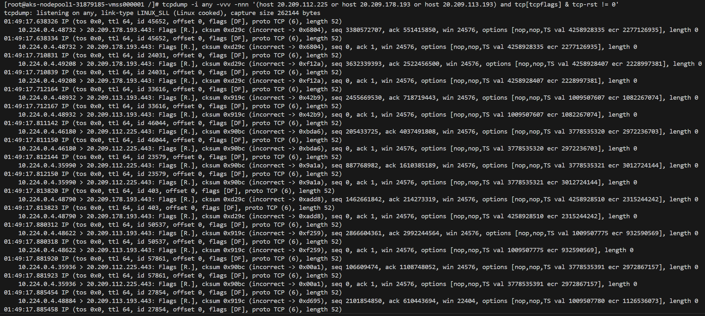

# ClickHouse using Azure Blob Storage experiments

Simple experiments to test ClickHouse using Azure Blob Storage and high number of connections.

Connect to a test AKS node in the same region as the storage account to run ClickHouse server

```bash
kubectl debug node/aks-nodepool1-31879185-vmss000001 -it --image=ubuntu --profile=sysadmin

# Install tools
apt update
apt install curl vim -y

# Install ClickHouse
curl https://clickhouse.com/ | sh

# Create config.xml file with contents similar to the one in this repo pointing to the storage account

# Run ClickHouse as server
./clickhouse server
```

Connect to the same AKS node to run the client

```bash
kubectl debug node/aks-nodepool1-31879185-vmss000001 -it --image=ubuntu --profile=sysadmin

# Install tools
apt update
apt install curl vim -y

# Install ClickHouse
curl https://clickhouse.com/ | sh

# Run ClickHouse as client
./clickhouse client
```

Connect to the same AKS node to run network monitoring tools

```bash
kubectl debug node/aks-nodepool1-31879185-vmss000001 -it --image=jrecord/nettools --profile=sysadmin

# Count number of connections to blob storage IPs
watch -n 1 'netstat -an | grep 20.209. | grep ESTABLISHED | wc -l'

# Capture RST packets to blob storage IPs
tcpdump -i any -vvv -nnn '(host 20.209.112.225 or host 20.209.178.193 or host 20.209.113.193) and tcp[tcpflags] & tcp-rst != 0'
```

Create wide table in ClickHouse backed by Azure Blob Storage by executing the following SQL command in the ClickHouse client

[create-table.sql](./create-table.sql)

Insert 10M rows into the test table by executing the following SQL command in the ClickHouse client

[insert-rows.sql](./insert-rows.sql)

Cause spike in connections to storage and consequent RST packets by executing the following SQL command in the ClickHouse client (vary max_threads to make it even more aggressive, but larger values can OOMKill the server)

```sql
select count(*) from test_wide where col100 like '2000%' or col99 like 'col99_2%' or col96 like '%col96_%' group by a, b, c, d, e, f, col7 limit 10 settings max_threads = 45;
```

While the command is running in the client watch the number of connections to the storage account IPs and/or the number of RST packets in the tcpdump output

